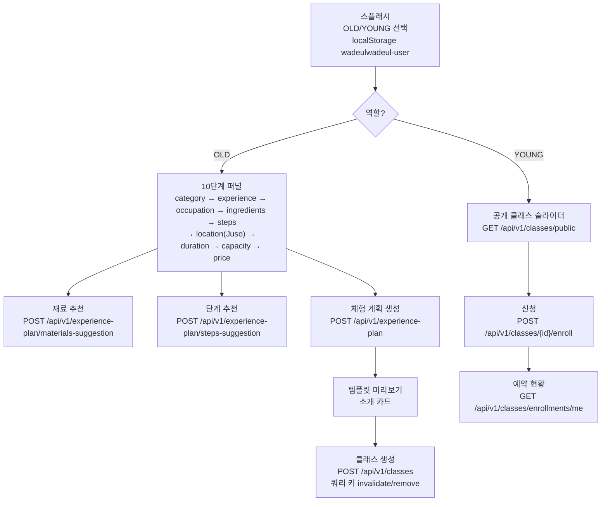

# Wadeulwadeul Heroes Frontend

> 시니어가 운영하는 원데이 클래스와 LLM 기반 체험 기획을 보여주는 React 프런트엔드입니다.
- React 19 + Vite + TypeScript + Vapor UI 디자인 시스템(Tailwind v4)로 작성
- TanStack Query 5로 캐시/요청 관리, axios `/wadeul` 프록시를 통해 백엔드와 연동
- OLD/ YOUNG 샘플 계정 기반의 클래스 생성·신청·예약 확인 흐름

## 기술 스택
- React 19, TypeScript(strict), Vite 5
- UI: `@vapor-ui/core` + Tailwind v4(`@tailwindcss/vite`), Swiper 기반 `ImageSlider`
- 상태/데이터: TanStack React Query 5 (retry 1회, refetchOnWindowFocus false, staleTime 5분), axios 인터셉터
- 기타: `@use-funnel/react-router-dom` 퍼널, `notistack` 토스트, Kakao Maps SDK(autoload=false), 주소 검색 Juso JSONP

## 주요 폴더
```
src/
  main.tsx               # QueryClient, Router, axios 인터셉터, ToastProvider 주입
  App.tsx                # 공용 레이아웃 및 user 세션 가드
  router.tsx             # react-router-dom v7 createBrowserRouter 설정
  pages/
    Main.tsx             # OLD/YOUNG 진입 스플래시, 샘플 사용자 저장
    ExperienceForm.tsx   # 10단계 퍼널, LLM 추천/템플릿 기반 클래스 작성
    creator/{CreatorMain.tsx, CreatorClassList.tsx}
    user/{UserMain.tsx, UserReservations.tsx, NavMenu.tsx}
    Map.tsx              # Kakao 지도 데모
  shared/
    api/{index.ts,juso.ts,queries/*.ts}  # axios 클라이언트, Juso 주소 검색, React Query 훅
    ui/{Funnel,ImageSlider,Map,Number,ClassTemplate,BottomNav,Skeleton,...}
    hook/ToastProvider.tsx
  types/kakao.ts
k8s/frontend/*.yaml
Dockerfile, nginx.conf, vite.config.ts, tsconfig.json, index.html
```

## LLM 기반 클래스 생성 UI


## 핵심 기술 포인트
- Vapor UI + Tailwind v4 테마(`v-` 프리픽스) 우선 사용, 커스텀 스타일 최소화.
- React Query 전역 옵션: retry 1회, refetchOnWindowFocus=false, staleTime=5분. `classKeys`/`experience-plan` 훅에서 invalidate/remove로 캐시 정합성 유지.
- axios 기본 경로는 `/wadeul` 프록시(`VITE_API_BASE_URL`로 오버라이드 가능). 인터셉터가 브라우저 타임존/국가 헤더와 `wadeulwadeul-user`를 주입.
- OLD/ YOUNG 샘플 ID를 스플래시에서 localStorage(`wadeulwadeul-user`)에 저장. App 레벨에서 세션 없으면 `/`로 리다이렉트.
- 주소 검색은 Juso JSONP(`searchJusoAddress`)로 CORS 없이 수행, SQL 키워드/특수문자 sanitize.
- Kakao Maps SDK는 `index.html`에서 `autoload=false`로 삽입 후 `window.kakao.maps.load` 가드. Map 컴포넌트는 DOM 존재 여부를 검사 후 렌더.
- `ImageSlider`는 Swiper 기반(hover/tap flip), `ToastProvider`는 notistack top-right 토스트를 제공.

## 빠른 시작
1) 요구 사항: Node 22, npm 10, 백엔드(`https://goormthon-5.goorm.training` 또는 로컬 프록시 대상) 접근 가능.
2) 의존성 설치: `npm ci`
3) 개발 서버: `npm run dev` (`--mode localdev`, 포트 5173, `/wadeul` → `https://goormthon-5.goorm.training` 프록시)
4) 프로덕션 빌드: `npm run build:prod` (일반 빌드 `npm run build`, 프리뷰 `npm run preview`)
5) 스플래시에서 OLD=창작자/ YOUNG=참여자 샘플을 선택해 세션을 만든 뒤 화면을 탐색합니다.

## 환경 변수
- `VITE_API_BASE_URL` (선택): API 기본 URL. 미지정 시 로컬 개발은 `/wadeul` 프록시, 기타 모드는 `https://goormthon-5.goorm.training`을 사용.
- Kakao Maps SDK 키는 `index.html`에 박혀 있으므로 배포 환경에 맞게 교체하세요.

## 사용자/요청 헤더
- 로컬 스토리지 키: `wadeulwadeul-user` (`Main.tsx`에서 OLD/YOUNG 샘플 ID 저장).
- axios 인터셉터가 `wadeulwadeul-user`, `X-Browser-Timezone`, `X-Browser-Country`를 헤더로 추가합니다.
- 인증이 필요한 화면(creator/user)은 세션 없을 시 `/`로 리다이렉트합니다.

## 주요 API 연동
- 헬스체크: `GET /api/health/ping`
- LLM 체험 기획: `POST /api/v1/experience-plan`, `/materials-suggestion`, `/steps-suggestion`
- 클래스: `GET /api/v1/classes`(OLD)/`/public`(YOUNG), `GET /api/v1/classes/{id}`, `POST /api/v1/classes`, `PUT/DELETE /api/v1/classes/{id}`
- 신청/예약: `POST /api/v1/classes/{id}/enroll`, `GET /api/v1/classes/enrollments/me`, `GET /api/v1/classes/my-classes/enrollments`, `DELETE /api/v1/classes/enrollments/{id}`
- 사용자: `GET /api/v1/users/me`(세션 필수), CRUD `/api/v1/users`

## 품질/빌드
- 포맷/린트 스크립트는 아직 정의되어 있지 않습니다. 필요 시 Vapor/Tailwind 스타일 가이드를 맞춰 추가하세요.
- 빌드 산출물은 `dist/`, nginx 정적 서빙(`nginx.conf`)을 사용합니다.

## Docker (선택)
```bash
docker build -t wadeulwadeul-heroes-fe .
docker run -p 8080:80 wadeulwadeul-heroes-fe
curl http://localhost:8080/health
```

## 배포
- K8s 매니페스트: `k8s/frontend` (ns `goormthon-5`, ingress `goormthon-5.goorm.training`, 헬스 `/health`).
- Node 22 / Vite 5 / nginx 1.27 버전은 고정 유지합니다.
